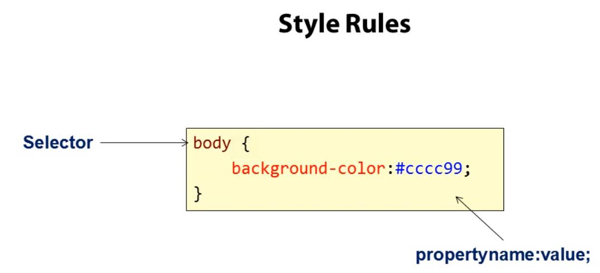
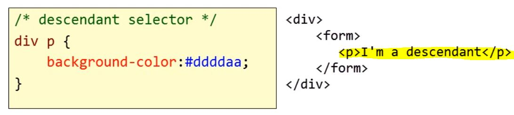
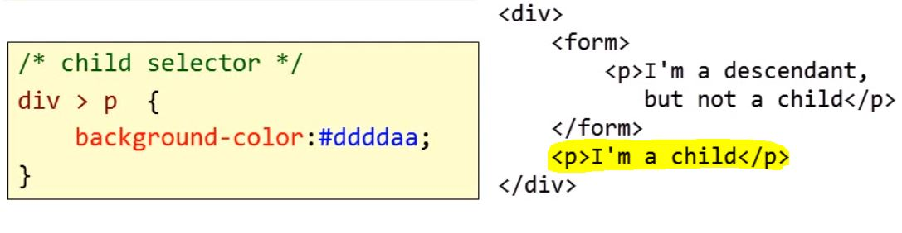
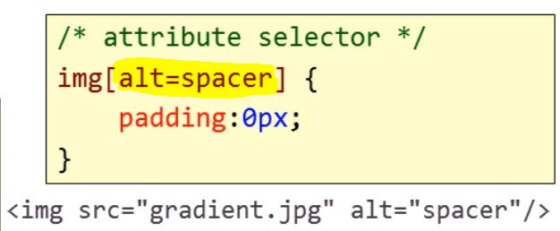
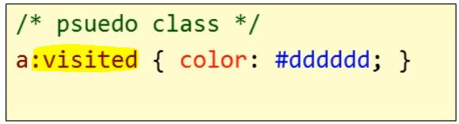

# Tools

### Brackets

[Download here](<http://brackets.io/>)

# CSS file

## Rules



## Selectors


```css
h1 {
    font-size: 10px;
}
```

```css
p {
  font-size: 20px;
}
```

```css
h1, h2 {
    background-color: red;
}
```

```css
#division-id {
    
}
```

```
.class-name {
    
}
```

## Other selectors

### Descendant selector

e.g: *anything paragraph inside a division*




### Child selector

e.g: *only selectors directly after the division*



### Attribute selector

e.g: *find all images with the attribute alt=spacer and set the padding to Xpx*



### Pseudo class

